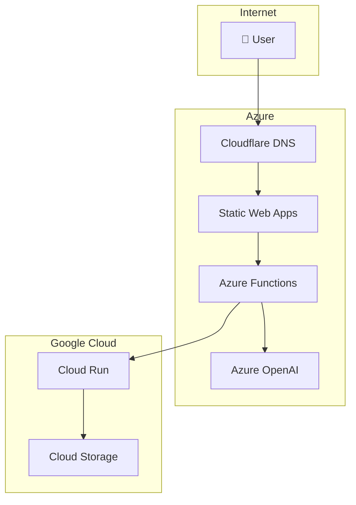

# Diagrams

Architecture diagrams live here.

## Strategy

- **Brainstorming:** Excalidraw (hand-drawn style, great for early-stage)
- **Architecture:** diagrams.net (draw.io) or Mermaid in markdown
- **Diagrams are never monolithic** — one focused diagram per topic

## Diagram Topics

| Topic | Tool | Status |
|-------|------|--------|
| Executive Overview | Excalidraw | 🔄 Next |
| Azure Landing Zone | diagrams.net | ⬜ |
| GCP Organization | diagrams.net | ⬜ |
| Identity (Entra + Cloud Identity) | diagrams.net | ⬜ |
| Networking | diagrams.net | ⬜ |
| Security | diagrams.net | ⬜ |
| Monitoring | diagrams.net | ⬜ |
| Application Architecture | Mermaid | ⬜ |
| AI Agent Flow | Mermaid | ⬜ |
| CI/CD Pipeline | Mermaid | ⬜ |
| FinOps / Cost Flow | diagrams.net | ⬜ |
| Disaster Recovery | diagrams.net | ⬜ |

## Naming Convention

```
<topic>-<detail>.<ext>

Examples:
├── executive-overview.excalidraw
├── azure-landing-zone.drawio
├── gcp-organization.drawio
├── identity-overview.drawio
├── network-vnet.drawio
├── app-architecture-flow.mmd
└── cicd-pipeline.mmd
```

## Export Formats

- `.drawio.png` — for embedding in docs/markdown
- `.excalidraw` — kept as-is (mergeable in Git)
- `.mmd` — Mermaid diagrams embeddable directly in markdown

---

## Quick: Mermaid Diagram Template


